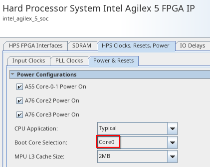
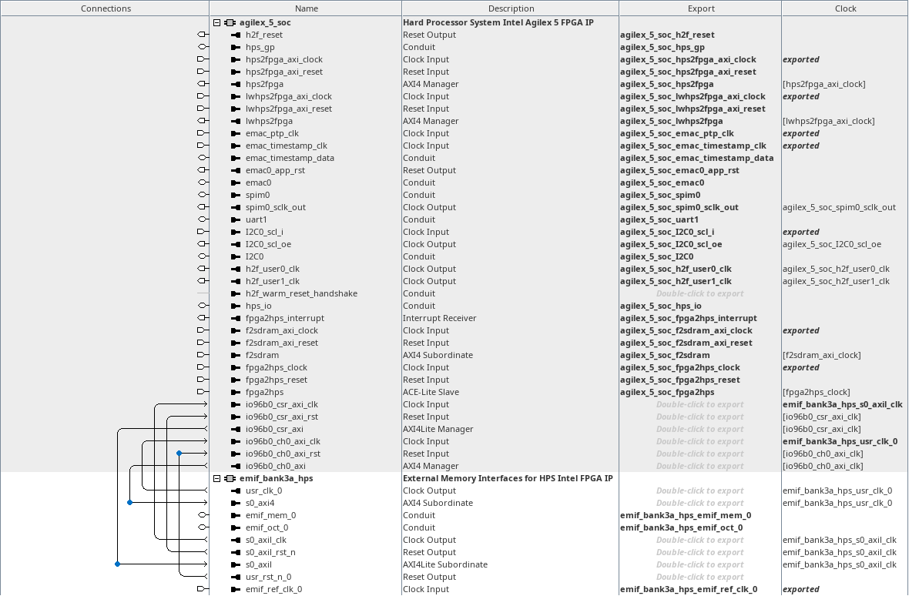
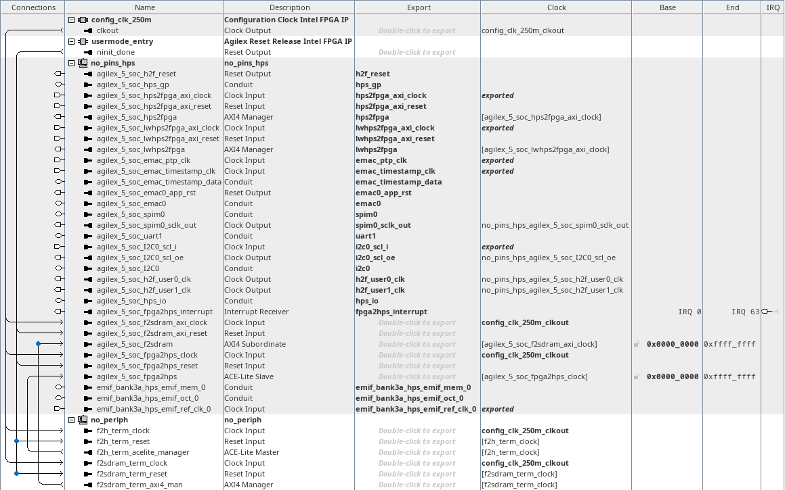

# Top-Level PD System
<!-- SPDX-FileCopyrightText: Copyright (C) 2024 Intel Corporation -->
<!-- SPDX-License-Identifier: MIT-0 -->

Return to [**Index**](01_index.md)

Hardware projects referenced from this document:
* common_pd_subsystems/hw_a55_no_periph
* common_pd_subsystems/hw_a76_no_periph

u-boot software applications referenced from this document:
* none

Linux software applications referenced from this document:
* none

## Overview

The top-level Platform Designer system is used to create the phase 1 bitstream that configures the Agilex 5 device at power-on or after a device wipe.

## Two phase 1 bitstreams

Only one phase 1 bitstream can be used to configure the device following a power-on or device wipe event, but this project creates two different Quartus projects to define two different phase 1 bitstream options.  One project defines the boot CPU as a Cortex A55 core, and the other project defines the boot CPU as a Cortex A76 core.

Each board build directory creates two Quartus projects that are used to build the phase 1 bitstream. These are the two project directories:
* hw_a55_no_periph
* hw_a76_no_periph

The Cortex A55 project selects core 0 for the boot core:

| Cortex A55 Boot CPU Selection |
| :---: |
|  |

The Cortex A76 project selects core 2 for the boot core:

| Cortex A76 Boot CPU Selection |
| :---: |
|  |

## HPS subsystem

The HPS core is implemented in a subsystem which includes the HPS EMIF controller instance along with the connections between the HPS core and the HPS EMIF core. All the other interfaces are exported from this subsystem into the next level up to be integrated with other subsystems that demonstrate specific interface connections.

The HPS subsystem enables the following interfaces between the HPS and FPGA fabric which are exported:
* h2f_reset interface
* hps_gp interface
* hps2fgpa bridge interface
* lwhps2fpga bridge interface
* emac interface
* spim interface
* uart interface
* i2c interface
* h2f_user0_clk and h2f_user1_clk interfaces
* fpga2hps_interrupt interface
* fpga2sdram bridge interface
* fpga2hps bridge interface

The hps_io interface carries the HPS IO pins defined for the console UART and the emif_mem, emif_oct and emif_ref_clk interfaces are exported to wire to the HPS EMIF DRAM pins.

This is what the HPS subsystem looks like in Platform Designer:

| Platform Designer HPS Subsystem |
| :---: |
|  |

## Top-level system

The HPS subsystem defined above, is instantiated into a top-level Platform Designer system to allow connections to other subsystems and resources to enable each specific demo. In the base phase 1 designs, as shown below, we can see the configuration clock core and the Reset Release IP core that provide us with a clock source and a reset that releases upon entry to user mode. There is also a subsystem instantiated that is called no_periph. The no_periph subsystem provides some trivial termination interfaces that are connected to the F2H bridge and the F2SDRAM bridge. This is likely a temporary requirement in the early Quartus tools that support Agilex 5, and will likely be removed in future tools releases.

This is what the top-level subsystem looks like in Platform Designer:

| Platform Designer HPS Subsystem |
| :---: |
|  |

---
Return to [**Index**](01_index.md)
