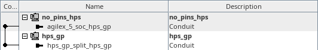
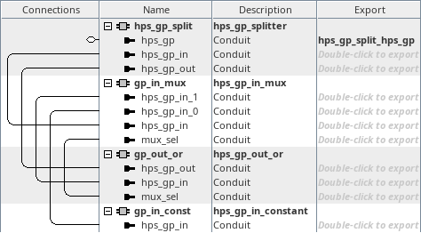

# menu-g on hw_hps_gp
<!-- SPDX-FileCopyrightText: Copyright (C) 2024 Intel Corporation -->
<!-- SPDX-License-Identifier: MIT-0 -->

Return to [**Index**](01_index.md)

Hardware projects referenced from this document:
* common_pd_subsystems/hw_hps_gp

u-boot software applications referenced from this document:
* common_sw/u-boot_standalone_apps/hps_gp.c

Linux software applications referenced from this document:
* common_sw/linux_apps/hps_gp.c

## Overview

The menu-g demo demonstrates how to write values out to the hps_gp_out interface and read values in from the hps_gp_in interface.

## Hardware system

The menu-g, hps_gp demo, connects some simple asynchronous cores in the hps_gp subsystem to the hps_gp interface on the HPS core.

| hw_hps_gp top level |
| :---: |
|  |

Inside the hps_gp subsystem, we instantiate a component that splits the hps_gp_in and hps_gp_out interfaces from the hps_gp conduit. The hps_gp_in interface receives the input from a mux which selects one of two inputs. The mux select is chosen by the state of the hps_gp_out interface, when it is zero, the mux selects the input from a constant component and when the hps_gp_out interface is non-zero, the mux selects the input from the hps_gp_out interface.

This allows us to write a zero to the hps_gp_out port and read a constant value back from the hps_gp_in port. And then we can drive any non-zero pattern out the hps_gp_out port and read that value back from the hps_gp_in port.

| hps_gp subsystem |
| :---: |
|  |


## Software demo - u-boot standalone - menu-g

In the u-boot standalone application we read and write the hps_gp_in and hps_gp_out registers with common C syntax. Here we query the constant value from the FPGA logic by writing a zero to the hps_gp_in port:

```text
	/* validate the hps_gp_in signature */
	*((volatile uint32_t *)(HPS_GP_OUT_BASE)) = 0;
	gp_in = *((volatile uint32_t *)(HPS_GP_IN_BASE));

	if(gp_in != GPIO_SIG)
		return;
```
Then we test each individual bit across the 32-bit vector:

```text
	/* verify each bit in the 32-bit vector */
	for(i = 0 ; i < 32 ; i++) {
		/* write the gp_out register */
		*((volatile uint32_t *)(HPS_GP_OUT_BASE)) = 1 << i;

		/* read the gp_in register */
		gp_in = *((volatile uint32_t *)(HPS_GP_IN_BASE));
	}
```

The output from this demo is shown below. The value of the signature read back from the constant is displayed and the value of the read back when writing each bit position to 1 is displayed. The read and write operations to the hps_gp_in and hps_gp_out ports are timed for each access and that timing is also output in the results.

```text
HPS GP Demo

HPS_GP_IN signature value = 0x4F495047 : GPIO

IDX: GPIN VAL : GPOUT WR  : GPIN RD    | IDX: GPIN VAL : GPOUT WR  : GPIN RD
---+----------+-----------+------------+---------------+-----------+----------
  0: 00000001 :  42.500ns : 272.500ns  |  16: 00010000 :  40.000ns : 280.000ns
  1: 00000002 :  40.000ns : 280.000ns  |  17: 00020000 :  45.000ns : 267.500ns
  2: 00000004 :  45.000ns : 267.500ns  |  18: 00040000 :  45.000ns : 267.500ns
  3: 00000008 :  45.000ns : 270.000ns  |  19: 00080000 :  45.000ns : 267.500ns
  4: 00000010 :  45.000ns : 265.000ns  |  20: 00100000 :  45.000ns : 267.500ns
  5: 00000020 :  42.500ns : 262.500ns  |  21: 00200000 :  45.000ns : 267.500ns
  6: 00000040 :  45.000ns : 267.500ns  |  22: 00400000 :  45.000ns : 267.500ns
  7: 00000080 :  45.000ns : 267.500ns  |  23: 00800000 :  45.000ns : 267.500ns
  8: 00000100 :  40.000ns : 280.000ns  |  24: 01000000 :  45.000ns : 267.500ns
  9: 00000200 :  45.000ns : 267.500ns  |  25: 02000000 :  45.000ns : 267.500ns
 10: 00000400 :  45.000ns : 270.000ns  |  26: 04000000 :  40.000ns : 267.500ns
 11: 00000800 :  45.000ns : 270.000ns  |  27: 08000000 :  42.500ns : 255.000ns
 12: 00001000 :  45.000ns : 267.500ns  |  28: 10000000 :  45.000ns : 267.500ns
 13: 00002000 :  45.000ns : 267.500ns  |  29: 20000000 :  45.000ns : 267.500ns
 14: 00004000 :  45.000ns : 267.500ns  |  30: 40000000 :  45.000ns : 267.500ns
 15: 00008000 :  45.000ns : 267.500ns  |  31: 80000000 :  45.000ns : 267.500ns

Press any key to exit this demo.
```

## Software demo - Linux - menu-g

The Linux version of this demo is essentially the same as the u-boot standalone application except in Linux we must map a virtual address to access the physical addresses of the peripherals. We use the uio driver to facilitate that for us.

---
Return to [**Index**](01_index.md)
