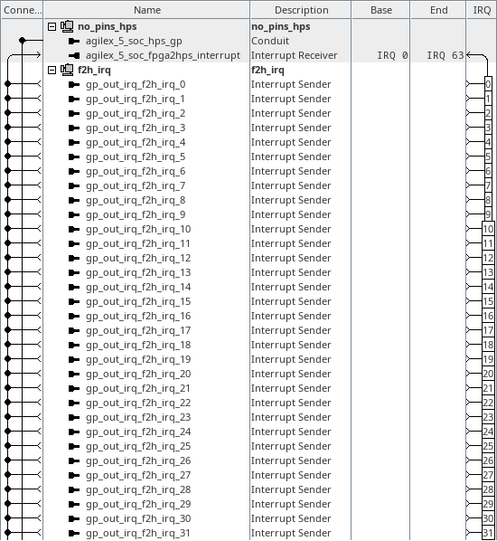

# menu-i, menu-l on hw_f2h_irq
<!-- SPDX-FileCopyrightText: Copyright (C) 2024 Intel Corporation -->
<!-- SPDX-License-Identifier: MIT-0 -->

Return to [**Index**](01_index.md)

Hardware projects referenced from this document:
* common_pd_subsystems/hw_f2h_irq

u-boot software applications referenced from this document:
* common_sw/u-boot_standalone_apps/f2h_irq.c
* common_sw/u-boot_standalone_apps/f2h_irq_handler.c

Linux software applications referenced from this document:
* common_sw/linux_apps/f2h_irq.c
* common_sw/linux_apps/f2h_irq_handler.c

## Overview

The menu-i and menu-l demos demonstrate how to sense the values of IRQ inputs driven into the f2h_irq interface. There are two software demos provided which demonstrate sensing these IRQ values in two different ways. The menu-i software demo shows how you can read the state of the IRQ through the ISPENDR1, ISPENDR2 and ISPENDR3 registers within the GIC. The menu-l software demo shows how you can arm the GIC to generate an interrupt to the CPU based on the f2h_irq input state.

## Hardware system

The menu-i, f2h irq demo, and the menu-l, f2h irq handler demo, use the same hardware design that connects a custom peripheral to convert the lower six bits of the hps_gp_out port into a 64-bit vector that is driven into the f2h_irq interface. The lower six bits are used to select one bit in the 64-bit vector to drive into the f2h_irq interface. So software can trigger any of the 64 possible IRQs through the f2h_irq interface.

| hw_f2h_irq top level |
| :---: |
|  |
|  |

Inside the f2h_irq subsystem, we instantiate an hp_gp_splitter core and then drive a constant into the hps_gp_in interface and we take the hps_gp_out interface into an hps_gp_out_irq core that converts the lower six bits of the hps_gp_out interface into a 64-bit vector value when then connects into the f2h_irq interface.

| f2h_irq subsystem |
| :---: |
|  |
|  |

## Software demo - u-boot standalone - menu-i

In the u-boot standalone application we drive the 64 different values out the hps_gp_out interface and then read the ISPENDR1, ISPENDR2 and ISPENDR3 registers in the GIC to sense the value presented to the f2h_irq interface.

```text
	/* verify 64-bits of the 64-bit irq vector */
	for(i = 0 ; i < 64 ; i++) {

		/* write the gp_out register */
		*((volatile uint32_t *)(HPS_GP_OUT_BASE)) = 0xFFFFFFC0 | i;

		/* read the gic ispendr registers */
		ispendr1 = *((volatile uint32_t *)(GIC_ISPENDR1_BASE));
		ispendr2 = *((volatile uint32_t *)(GIC_ISPENDR2_BASE));
		ispendr3 = *((volatile uint32_t *)(GIC_ISPENDR3_BASE));
	}
```

The output from this demo is shown below. The value of the signature read back from the constant is displayed and the value of the read back when writing each f2h_irq bit position to 1 is displayed. You can observe the walking one bit up the ISPENDR1 register, through the ISPENDR2 register and into the ISPENDR3 register. The read operations to the GIC registers are timed for each access and that timing is also output at the bottom of the results.

```text
F2H IRQ Demo

HPS_GP_IN signature value = 0x20515249 : IRQ

f2h_irq mappings: ISPENDR1[17]=f2s_fpga_irq0 thru ISPENDR3[16]=f2s_fpga_irq63

  IDX: ISPENDR3 | ISPENDR2 | ISPENDR1 |  IDX: ISPENDR3 | ISPENDR2 | ISPENDR1 |
-----+----------+----------+----------+-----+----------+----------+----------+
 INIT: 00000000 : 00000000 : 00008000 :
    0: 00000000 : 00000000 : 00028000 |   32: 00000000 : 00020000 : 00008000
    1: 00000000 : 00000000 : 00048000 |   33: 00000000 : 00040000 : 00008000
    2: 00000000 : 00000000 : 00088000 |   34: 00000000 : 00080000 : 00008000
    3: 00000000 : 00000000 : 00108000 |   35: 00000000 : 00100000 : 00008000
    4: 00000000 : 00000000 : 00208000 |   36: 00000000 : 00200000 : 00008000
    5: 00000000 : 00000000 : 00408000 |   37: 00000000 : 00400000 : 00008000
    6: 00000000 : 00000000 : 00808000 |   38: 00000000 : 00800000 : 00008000
    7: 00000000 : 00000000 : 01008000 |   39: 00000000 : 01000000 : 00008000
    8: 00000000 : 00000000 : 02008000 |   40: 00000000 : 02000000 : 00008000
    9: 00000000 : 00000000 : 04008000 |   41: 00000000 : 04000000 : 00008000
   10: 00000000 : 00000000 : 08008000 |   42: 00000000 : 08000000 : 00008000
   11: 00000000 : 00000000 : 10008000 |   43: 00000000 : 10000000 : 00008000
   12: 00000000 : 00000000 : 20008000 |   44: 00000000 : 20000000 : 00008000
   13: 00000000 : 00000000 : 40008000 |   45: 00000000 : 40000000 : 00008000
   14: 00000000 : 00000000 : 80008000 |   46: 00000000 : 80000000 : 00008000
   15: 00000000 : 00000001 : 00008000 |   47: 00000001 : 00000000 : 00008000
   16: 00000000 : 00000002 : 00008000 |   48: 00000002 : 00000000 : 00008000
   17: 00000000 : 00000004 : 00008000 |   49: 00000004 : 00000000 : 00008000
   18: 00000000 : 00000008 : 00008000 |   50: 00000008 : 00000000 : 00008000
   19: 00000000 : 00000010 : 00008000 |   51: 00000010 : 00000000 : 00008000
   20: 00000000 : 00000020 : 00008000 |   52: 00000020 : 00000000 : 00008000
   21: 00000000 : 00000040 : 00008000 |   53: 00000040 : 00000000 : 00008000
   22: 00000000 : 00000080 : 00008000 |   54: 00000080 : 00000000 : 00008000
   23: 00000000 : 00000100 : 00008000 |   55: 00000100 : 00000000 : 00008000
   24: 00000000 : 00000200 : 00008000 |   56: 00000200 : 00000000 : 00008000
   25: 00000000 : 00000400 : 00008000 |   57: 00000400 : 00000000 : 00008000
   26: 00000000 : 00000800 : 00008000 |   58: 00000800 : 00000000 : 00008000
   27: 00000000 : 00001000 : 00008000 |   59: 00001000 : 00000000 : 00008000
   28: 00000000 : 00002000 : 00008000 |   60: 00002000 : 00000000 : 00008000
   29: 00000000 : 00004000 : 00008000 |   61: 00004000 : 00000000 : 00008000
   30: 00000000 : 00008000 : 00008000 |   62: 00008000 : 00000000 : 00008000
   31: 00000000 : 00010000 : 00008000 |   63: 00010000 : 00000000 : 00008000

GIC access times in nanoseconds for each index above.
 0:2292 |  8:2285 | 16:2285 | 24:2292 | 32:2285 | 40:2285 | 48:2292 | 56:2292 |
 1:2295 |  9:2290 | 17:2292 | 25:2292 | 33:2292 | 41:2292 | 49:2290 | 57:2292 |
 2:2290 | 10:2285 | 18:2292 | 26:2292 | 34:2290 | 42:2292 | 50:2285 | 58:2290 |
 3:2292 | 11:2285 | 19:2285 | 27:2285 | 35:2292 | 43:2285 | 51:2285 | 59:2292 |
 4:2290 | 12:2292 | 20:2292 | 28:2292 | 36:2292 | 44:2285 | 52:2285 | 60:2292 |
 5:2300 | 13:2292 | 21:2292 | 29:2292 | 37:2300 | 45:2300 | 53:2290 | 61:2292 |
 6:2290 | 14:2292 | 22:2292 | 30:2292 | 38:2285 | 46:2292 | 54:2292 | 62:2285 |
 7:2292 | 15:2300 | 23:2290 | 31:2290 | 39:2300 | 47:2300 | 55:2292 | 63:2292 |

Press any key to exit this demo.
```

## Software demo - u-boot standalone - menu-l

In the u-boot standalone application we drive the 64 different values out the hps_gp_out interface and then we wait for an interrupt to occur and force us into the exception handler to deal with the interrupt. If the interrupt does not fire, then the software will timeout and return a zero value for the GIC INTID value.

Please refer to the actual software source file to see how this is performed.

The output from this demo is shown below. The value of the signature read back from the constant is displayed and the value of the GIC INTID returned by the interrupt handler is printed along with the f2h_irq index value that was driven by the hps_gp_out value. The interrupt handling time is measured and the time to enter the ISR and return from the ISR are output in the results as well.

```text
F2H IRQ Handler Demo

HPS_GP_IN signature value = 0x20515249 : IRQ

  FPGA :  TIME TO  : TIME FROM :  GIC     FPGA :  TIME TO  : TIME FROM :  GIC
  IRQ  :    ISR    :    ISR    : INTID    IRQ  :    ISR    :    ISR    : INTID
 ------+-----------+-----------+-------  ------+-----------+-----------+-------
     0 :    960 ns :    780 ns :    49      32 :    547 ns :    505 ns :    81
     1 :    560 ns :    532 ns :    50      33 :    552 ns :    505 ns :    82
     2 :    557 ns :    502 ns :    51      34 :    545 ns :    507 ns :    83
     3 :    545 ns :    507 ns :    52      35 :    560 ns :    507 ns :    84
     4 :    560 ns :    507 ns :    53      36 :    552 ns :    507 ns :    85
     5 :    560 ns :    507 ns :    54      37 :    560 ns :    507 ns :    86
     6 :    560 ns :    507 ns :    55      38 :    560 ns :    507 ns :    87
     7 :    560 ns :    507 ns :    56      39 :    547 ns :    505 ns :    88
     8 :    560 ns :    507 ns :    57      40 :    545 ns :    507 ns :    89
     9 :    552 ns :    507 ns :    58      41 :    547 ns :    507 ns :    90
    10 :    552 ns :    507 ns :    59      42 :    560 ns :    507 ns :    91
    11 :    560 ns :    507 ns :    60      43 :    552 ns :    507 ns :    92
    12 :    547 ns :    505 ns :    61      44 :    560 ns :    507 ns :    93
    13 :    557 ns :    502 ns :    62      45 :    560 ns :    507 ns :    94
    14 :    545 ns :    507 ns :    63      46 :    560 ns :    507 ns :    95
    15 :    560 ns :    507 ns :    64      47 :    560 ns :    507 ns :    96
    16 :    560 ns :    507 ns :    65      48 :    560 ns :    507 ns :    97
    17 :    560 ns :    502 ns :    66      49 :    547 ns :    507 ns :    98
    18 :    552 ns :    507 ns :    67      50 :    560 ns :    507 ns :    99
    19 :    552 ns :    507 ns :    68      51 :    560 ns :    507 ns :   100
    20 :    547 ns :    505 ns :    69      52 :    560 ns :    507 ns :   101
    21 :    545 ns :    507 ns :    70      53 :    547 ns :    505 ns :   102
    22 :    552 ns :    507 ns :    71      54 :    557 ns :    502 ns :   103
    23 :    560 ns :    507 ns :    72      55 :    552 ns :    507 ns :   104
    24 :    560 ns :    507 ns :    73      56 :    560 ns :    507 ns :   105
    25 :    545 ns :    507 ns :    74      57 :    560 ns :    502 ns :   106
    26 :    560 ns :    507 ns :    75      58 :    545 ns :    507 ns :   107
    27 :    560 ns :    507 ns :    76      59 :    560 ns :    507 ns :   108
    28 :    547 ns :    505 ns :    77      60 :    547 ns :    505 ns :   109
    29 :    545 ns :    507 ns :    78      61 :    557 ns :    502 ns :   110
    30 :    560 ns :    507 ns :    79      62 :    552 ns :    507 ns :   111
    31 :    552 ns :    507 ns :    80      63 :    552 ns :    507 ns :   112

Press any key to exit this demo.
```

## Software demo - Linux - menu-i and menu-l

The Linux version of this demo is essentially the same as the u-boot standalone application except in Linux we must map a virtual address to access the physical addresses of the peripherals. We use the uio driver to facilitate that for us.

For the menu-l implementation we also use the uio driver to register the IRQ for each of the 64-bit f2h_irq vector that we can test.

The output from the menu-i demo under Linux is very similar to the u-boot demo, but the menu-l output is a bit different. First the f2h_irq index is printed along with the devicetree interrupt value and the GIC INTID value. The IRQ time is significantly longer because of the more complex way the Linux environment requires the context switching to occur around the way the uio driver implements the IRQ handler.

```text
F2H IRQ Handler Demo

HPS_GP_IN signature value = 0x20515249 : IRQ

  FPGA : DTBO :  GIC  :    IRQ       FPGA : DTBO :  GIC  :    IRQ
  IRQ  : INT  : INTID :    TIME      IRQ  : INT  : INTID :    TIME
 ------+------+-------+-----------  ------+------+-------+-----------
     0 :   17 :    49 :  46272 ns      32 :   49 :    81 :  26292 ns
     1 :   18 :    50 :  26452 ns      33 :   50 :    82 :  16165 ns
     2 :   19 :    51 :  26360 ns      34 :   51 :    83 :  17507 ns
     3 :   20 :    52 :  24892 ns      35 :   52 :    84 :  23805 ns
     4 :   21 :    53 :  18980 ns      36 :   53 :    85 :  15770 ns
     5 :   22 :    54 :  15435 ns      37 :   54 :    86 :  17585 ns
     6 :   23 :    55 :  16155 ns      38 :   55 :    87 :  23930 ns
     7 :   24 :    56 :  26540 ns      39 :   56 :    88 :  18342 ns
     8 :   25 :    57 :  17062 ns      40 :   57 :    89 :  16725 ns
     9 :   26 :    58 :  16235 ns      41 :   58 :    90 :  26805 ns
    10 :   27 :    59 :  19232 ns      42 :   59 :    91 :  17467 ns
    11 :   28 :    60 :  24675 ns      43 :   60 :    92 :  17172 ns
    12 :   29 :    61 :  16152 ns      44 :   61 :    93 :  15220 ns
    13 :   30 :    62 :  15052 ns      45 :   62 :    94 :  24260 ns
    14 :   31 :    63 :  24447 ns      46 :   63 :    95 :  16652 ns
    15 :   32 :    64 :  18642 ns      47 :   64 :    96 :  18007 ns
    16 :   33 :    65 :  26292 ns      48 :   65 :    97 :  24947 ns
    17 :   34 :    66 :  16165 ns      49 :   66 :    98 :  18092 ns
    18 :   35 :    67 :  17507 ns      50 :   67 :    99 :  15765 ns
    19 :   36 :    68 :  23805 ns      51 :   68 :   100 :  23932 ns
    20 :   37 :    69 :  15770 ns      52 :   69 :   101 :  16315 ns
    21 :   38 :    70 :  17585 ns      53 :   70 :   102 :  26367 ns
    22 :   39 :    71 :  23930 ns      54 :   71 :   103 :  15632 ns
    23 :   40 :    72 :  18342 ns      55 :   72 :   104 :  17167 ns
    24 :   41 :    73 :  16725 ns      56 :   73 :   105 :  26560 ns
    25 :   42 :    74 :  26805 ns      57 :   74 :   106 :  19827 ns
    26 :   43 :    75 :  17467 ns      58 :   75 :   107 :  18260 ns
    27 :   44 :    76 :  17172 ns      59 :   76 :   108 :  16552 ns
    28 :   45 :    77 :  15220 ns      60 :   77 :   109 :  27112 ns
    29 :   46 :    78 :  24260 ns      61 :   78 :   110 :  18222 ns
    30 :   47 :    79 :  16652 ns      62 :   79 :   111 :  24352 ns
    31 :   48 :    80 :  18007 ns      63 :   80 :   112 :  18865 ns

Press any key to exit this demo.
```
---
Return to [**Index**](01_index.md)
