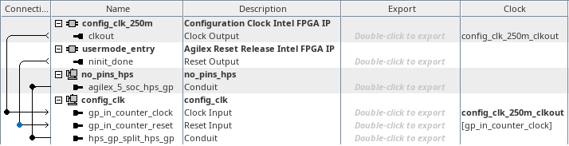
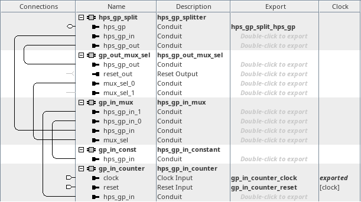

# menu-z on hw_config_clk
<!-- SPDX-FileCopyrightText: Copyright (C) 2024 Intel Corporation -->
<!-- SPDX-License-Identifier: MIT-0 -->

Return to [**Index**](01_index.md)

Hardware projects referenced from this document:
* common_pd_subsystems/hw_config_clk

u-boot software applications referenced from this document:
* common_sw/u-boot_standalone_apps/config_clk.c

Linux software applications referenced from this document:
* common_sw/linux_apps/config_clk.c

## Overview

The menu-z demo demonstrates the functionality of the configuration clock that is supplied into the FPGA core logic from the SDM. The configuration clock is derived from the internal oscillator within the SDM unless the user specifies the expected frequency for an external clock provided into the SDM OSC_CLK input pin. When the user specifies an SDM OSC_CLK frequency, the configuration clock provided into the FPGA fabric on 4S and 5S speed grade devices will be 250MHz, otherwise the frequency will be ~160MHz-230MHz based on the imprecise frequency of the internal oscillator. The configuration clock frequency for the 4S and 5S speed grade devices is expected to be 250MHz when an SDM OSC_CLK frequency is specified. The configuration clock frequency for the 6S speed grade device is expected to be 200MHz when an SDM OSC_CLK frequency is specified.

## Hardware system

The menu-z, config clock demo, connects the configuration clock to a 32-bit counter that is connected to the hps_gp_in interface so that software can read the counter value and calculate the frequency of the configuration clock. Since this is synchronous logic, we use the ninit_done reset indication to release the logic from reset after entering user mode.

| hw_config_clk top level |
| :---: |
|  |

Inside the config_clk subsystem, we instantiate a component that splits the hps_gp_in and hps_gp_out interfaces from the hps_gp conduit. The hps_gp_in interface receives the input from a mux which selects one of two inputs. The mux select is chosen by the state of the hps_gp_out interface. When the hps_gp_out interface is zero, the mux selects the input from a constant component and when the hps_gp_out interface is non-zero, the mux selects the input from the hps_gp_in_counter core which is clocked by the configuration clock.

This allows us to write a zero to the hps_gp_out port and read a constant value back from the hps_gp_in port. And then we can drive the mux select to one out the hps_gp_out port and read back the value of the counter.

| config_clk subsystem |
| :---: |
|  |


## Software demo - u-boot standalone - menu-z

In the u-boot standalone application we read and write the hps_gp_in and hps_gp_out registers with common C syntax. The demo queries and verifies the expected signature value from the constant presented to the hps_gp_in port. Then it drives the mux select value to switch the counter value onto the hps_gp_in port and it reads the current counter value. It waits for one second by using the system counter to create an accurate delay. Then it reads the config clock counter value a second time.

Knowing what the system counter frequency is and the configuration clock counter values for a one second duration, the demo can then calculate the frequency of the configuration clock.

```text
	/* validate the hps_gp_in signature */
	*((volatile uint32_t *)(HPS_GP_OUT_BASE)) = 0;
	gp_in = *((volatile uint32_t *)(HPS_GP_IN_BASE));

	config_clk->gp_sig_value = gp_in;

	if(gp_in != CCLK_SIG)
		return;

	/* switch mux to config clock input */
	*((volatile uint32_t *)(HPS_GP_OUT_BASE)) = 0x02;

	/* get the generic timer frequency */
    	asm volatile (
		"mrs %[cntfrq_el0], cntfrq_el0\n"
		: [cntfrq_el0] "=r" (cntfrq_el0)
	);

	/* aquire generic timer value and config clock counter */
	asm volatile (
		"mrs %[start_time], cntpct_el0\n"
		: [start_time] "=r" (start_time)
	);
	config_clk_start = *((volatile uint32_t *)(HPS_GP_IN_BASE));

	/* calculate 1 second delay and wait */
	end_time = start_time + cntfrq_el0;
	do {
		/* aquire generic timer value and config clock counter */
		asm volatile (
			"mrs %[cur_time], cntpct_el0\n"
			: [cur_time] "=r" (cur_time)
		);
		config_clk_end = *((volatile uint32_t *)(HPS_GP_IN_BASE));

	} while(cur_time < end_time);

	/* save the results */
	config_clk->config_clk_start = config_clk_start;
	config_clk->config_clk_end = config_clk_end;
```

The output from this demo is shown below. The value of the signature read back from the constant is displayed and the value of the counter before and after the one second delay is displayed.

```text
Configuration Clock Demo

HPS_GP_IN signature value = 0x4B4C4343 : CCLK

  Configuration Clock Stats:
      Counter Start = 0x24E25036
        Counter End = 0x33C9030B
      Counter Delta = 0x0EE6B2D5
          Frequency = 250000085 MHz

Press any key to exit this demo.
```

## Software demo - Linux - menu-z

The Linux version of this demo is essentially the same as the u-boot standalone application except in Linux we must map a virtual address to access the physical addresses of the peripherals. We use the uio driver to facilitate that for us.

---
Return to [**Index**](01_index.md)
