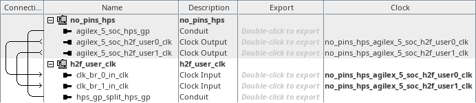

# menu-y on hw_h2f_user_clk
<!-- SPDX-FileCopyrightText: Copyright (C) 2024 Intel Corporation -->
<!-- SPDX-License-Identifier: MIT-0 -->

Return to [**Index**](01_index.md)

Hardware projects referenced from this document:
* common_pd_subsystems/hw_h2f_user_clk

u-boot software applications referenced from this document:
* common_sw/u-boot_standalone_apps/h2f_user_clk.c

Linux software applications referenced from this document:
* common_sw/linux_apps/h2f_user_clk.c

## Overview

The menu-y demo demonstrates the functionality of the two h2f_user clocks that are supplied into the FPGA core logic from the HPS. The h2f_user clocks are configured in the Platform Designer HPS configuration parameters under the HPS clocks and PLL configurations tab. Each clock can be derived from either HPS PLL. In this example we configure h2f_user0_clk for 400MHz and h2f_user1_clk for 200MHz.

## Hardware system

The menu-y, h2f_user clock demo, connects the two h2f_user clocks to two 32-bit counters that are connected to the hps_gp_in interface thru a mux so that software can read each counter value and calculate the frequency of the h2f_user clock that drives the counter. Since this is synchronous logic we need to properly reset the logic, but since the h2f_user clocks are not stable when the FPGA enters user mode in some cases, we have chosen to demonstrate how to use the hps_gp_out interface to create a reset signal that software can control and release the FPGA logic from reset when software believes the clocks are stable.

| hw_h2f_user_clk top level |
| :---: |
|  |

Inside the h2f_user_clk subsystem, we instantiate a component that splits the hps_gp_in and hps_gp_out interfaces from the hps_gp conduit. The hps_gp_in interface receives the input from a mux which selects one of three inputs. The mux select is chosen by the state of the hps_gp_out interface. When the hps_gp_out interface is zero, the mux selects the input from a constant component and when the hps_gp_out interface is non-zero, the mux selects the input from one of two hps_gp_in_counter cores which are clocked by the h2f_user0_clk or h2f_user1_clk clocks. The hps_gp_out_mux_sel core also produces a reset output interface that monitors the state of one of the hps_gp_out bits so software can assert and release the reset into the FPGA logic design.

This allows us to assert reset into the FPGA logic design until the clocks are stable and then release the design from reset. And then we can write a zero to the hps_gp_out port and read a constant value back from the hps_gp_in port. And then we can drive the mux select out the hps_gp_out port to select one of the two counters and read back the value of the counter.

| h2f_user_clk subsystem |
| :---: |
|  |


## Software demo - u-boot standalone - menu-y

In the u-boot standalone application we read and write the hps_gp_in and hps_gp_out registers with common C syntax. The demo queries and verifies the expected signature value from the constant presented to the hps_gp_in port. Then it drives the mux select value to switch the h2f_user0_clk counter value onto the hps_gp_in port and it reads the current counter value. It waits for one second by using the system counter to create an accurate delay. Then it reads the h2f_user0_clk clock counter value a second time. Then it drives the mux to switch the h2f_user1_clk onto the hps_gp_in port and it performs the same measurement for that counter.

Knowing what the system counter frequency is and the h2f_user clock counter values for a one second duration, the demo can then calculate the frequency for each h2f_user clock.

```text
	/* validate the hps_gp_in signature */
	*((volatile uint32_t *)(HPS_GP_OUT_BASE)) = 0;
	gp_in = *((volatile uint32_t *)(HPS_GP_IN_BASE));

	h2f_user_clk->gp_sig_value = gp_in;

	if(gp_in != UCLK_SIG)
		return;

	/* get the generic timer frequency */
    	asm volatile (
		"mrs %[cntfrq_el0], cntfrq_el0\n"
		: [cntfrq_el0] "=r" (cntfrq_el0)
	);

	/* release reset and set mux to h2f_user0_clk input */
	*((volatile uint32_t *)(HPS_GP_OUT_BASE)) = 0x03;

	/* aquire generic timer value and config clock counter */
	asm volatile (
		"mrs %[start_time], cntpct_el0\n"
		: [start_time] "=r" (start_time)
	);
	user_clk_start = *((volatile uint32_t *)(HPS_GP_IN_BASE));

	/* calculate 1 second delay and wait */
	end_time = start_time + cntfrq_el0;
	do {
		/* aquire generic timer value and config clock counter */
		asm volatile (
			"mrs %[cur_time], cntpct_el0\n"
			: [cur_time] "=r" (cur_time)
		);
		user_clk_end = *((volatile uint32_t *)(HPS_GP_IN_BASE));

	} while(cur_time < end_time);

	/* save the results */
	h2f_user_clk->user0_clk_start = user_clk_start;
	h2f_user_clk->user0_clk_end = user_clk_end;

	/* release reset and set mux to h2f_user1_clk input */
	*((volatile uint32_t *)(HPS_GP_OUT_BASE)) = 0x07;

	/* aquire generic timer value and config clock counter */
	asm volatile (
		"mrs %[start_time], cntpct_el0\n"
		: [start_time] "=r" (start_time)
	);
	user_clk_start = *((volatile uint32_t *)(HPS_GP_IN_BASE));

	/* calculate 1 second delay and wait */
	end_time = start_time + cntfrq_el0;
	do {
		/* aquire generic timer value and config clock counter */
		asm volatile (
			"mrs %[cur_time], cntpct_el0\n"
			: [cur_time] "=r" (cur_time)
		);
		user_clk_end = *((volatile uint32_t *)(HPS_GP_IN_BASE));

	} while(cur_time < end_time);

	/* save the results */
	h2f_user_clk->user1_clk_start = user_clk_start;
	h2f_user_clk->user1_clk_end = user_clk_end;
```

The output from this demo is shown below. The value of the signature read back from the constant is displayed and the value of the two counters before and after the one second delay is displayed.

```text
H2F User Clock Demo

HPS_GP_IN signature value = 0x4B4C4355 : UCLK

  H2F User0 Clock Stats:
      Counter Start = 0x0000000D
        Counter End = 0x0BEBC201
      Counter Delta = 0x0BEBC1F4
          Frequency = 199999988 MHz

  H2F User1 Clock Stats:
      Counter Start = 0x17D78488
        Counter End = 0x2FAF086C
      Counter Delta = 0x17D783E4
          Frequency = 399999972 MHz

Press any key to exit this demo.
```

## Software demo - Linux - menu-y

The Linux version of this demo is essentially the same as the u-boot standalone application except in Linux we must map a virtual address to access the physical addresses of the peripherals. We use the uio driver to facilitate that for us.

---
Return to [**Index**](01_index.md)
