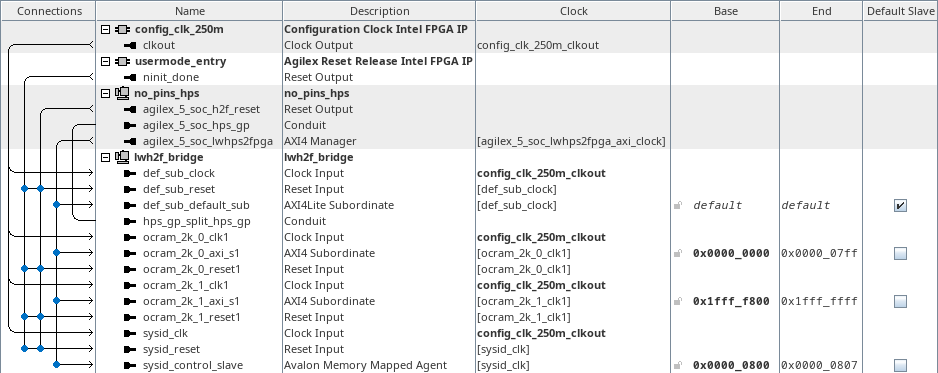
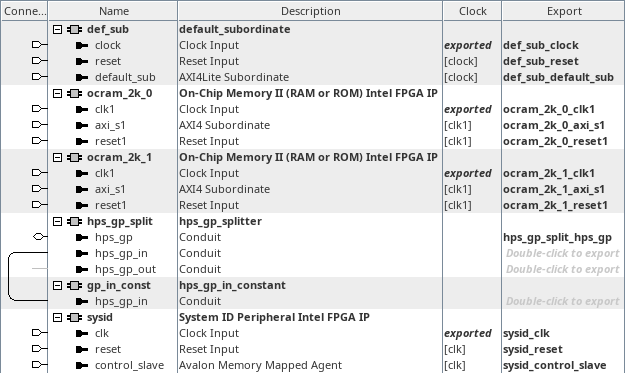

# menu-x, menu-w on hw_lwh2f_bridge
<!-- SPDX-FileCopyrightText: Copyright (C) 2024 Intel Corporation -->
<!-- SPDX-License-Identifier: MIT-0 -->

Return to [**Index**](01_index.md)

Hardware projects referenced from this document:
* common_pd_subsystems/hw_lwh2f_bridge

u-boot software applications referenced from this document:
* common_sw/u-boot_standalone_apps/lwh2f_bridge.c
* common_sw/u-boot_standalone_apps/lwh2f_bridge_def_sub.c

Linux software applications referenced from this document:
* common_sw/linux_apps/lwh2f_bridge.c
* common_sw/linux_apps/lwh2f_bridge_def_sub.c

## Overview

The menu-x and menu-w demos demonstrate the functionality of the lwh2f bridge. The lwh2f bridge is a memory mapped bridge that creates a 512MB aperture in the HPS address map to allow the processor to read/write FPGA peripheral CSRs, etc. The data width of the lwh2f bridge is fixed at 32-bits.

## Hardware system

The menu-x and menu-w, lwh2f bridge demo, connects the lwh2f bridge to two 2KB FPGA OCRAM cores, one mapped to the lowest 2KB span and one mapped to the highest 2KB span of the 512MB lwh2f bridge aperture. A System ID core is also connected to the lwh2f bridge, along with a default subordinate core. The FPGA OCRAM cores provide a trivial memory target that software can interact with. The System ID core provides a 32-bit value that we can set in Platform Designer to be a fixed constant and a timestamp value that is set with the build time of the hardware subsystem. We can use the System ID value as a signature to validate the presence of this specific design in the FPGA. The default subordinate is configured as the default slave on the lwh2f manager's interconnect so any undecoded transactions will be sent to the default subordinate, which will then respond with an error response over its AXI interface.

| hw_lwh2f_bridge top level |
| :---: |
|  |

Inside the lwh2f_bridge subsystem, we instantiate a component that splits the hps_gp_in and hps_gp_out interfaces from the hps_gp conduit. The hps_gp_in interface receives input from a constant component. We also see the two FPGA OCRAMs, default subordinate and System ID core that was mentioned above.

| lwh2f_bridge subsystem |
| :---: |
|  |


## Software demo - u-boot standalone - menu-x

### Memory validation

In the u-boot standalone application we read and write to the first word and last word of the FPGA OCRAMs in the 512MB aperture with common C syntax.

```text
	/* write and read the memories in the FPGA fabric */
	first_word_ptr = (uint64_t *)(LWH2F_512M_BASE);
	last_word_ptr = (uint64_t *)(LWH2F_512M_BASE + LWH2F_512M_SPAN -
							sizeof(uint64_t));

/* write to first word */
	*first_word_ptr = 0x1111111111111111;

/* write to last word */
	*last_word_ptr = 0x2222222222222222;

/* read from first word */
	temp = *first_word_ptr;
	lwh2f_bridge->lo_512m_readback[0] = temp;

/* read from last word */
	temp = *last_word_ptr;
	lwh2f_bridge->hi_512m_readback[0] = temp;

/* change the patterns and do it again */
/* write to first word */
	*first_word_ptr = ~0x1111111111111111;

/* write to last word */
	*last_word_ptr = ~0x2222222222222222;

/* read from first word */
	temp = *first_word_ptr;
	lwh2f_bridge->lo_512m_readback[1] = temp;

/* read from last word */
	temp = *last_word_ptr;
	lwh2f_bridge->hi_512m_readback[1] = temp;
```

The output from this demo is shown below. The value of the signature read back from the hps_gp_in constant is displayed as well as the System ID values. The read back values of the low memory word and the high memory word are printed along with the access times for each read and write operation over two passes.

```text
LWH2F Demo

HPS_GP_IN signature value = 0x3248574C : LWH2

SYSID_ID: 0x3248574C
SYSID_TS: 0x666D4C6F

   ---512MB SPAN--- :     ---PASS 1---   :     ---PASS 2---
LO WRITE ACCESS TIME:           80.000ns :           40.000ns
HI WRITE ACCESS TIME:          645.000ns :           40.000ns
 LO READ ACCESS TIME:          392.500ns :          585.000ns
 HI READ ACCESS TIME:          317.500ns :          315.000ns
        LO READ BACK: 0x1111111111111111 : 0xEEEEEEEEEEEEEEEE
        HI READ BACK: 0x2222222222222222 : 0xDDDDDDDDDDDDDDDD

Press any key to exit this demo.
```

## Software demo - u-boot standalone - menu-w

### Default subordinate validation

In the u-boot standalone application we install an exception handler to capture the exception that we will generate by reading from the default subordinate through the lwh2f bridge. We then cause a data abort exception by reading an undecoded address through the lwh2f bridge which is terminated by the default subordinate.

The output from this demo is shown below. The value of the signature read back from the hps_gp_in constant is displayed as well as the System ID values. The abort handler execution is printed along with the timing of various milestones throughout the event.

```text
LWH2F Default Subordinate Demo

HPS_GP_IN signature value = 0x3248574C : LWH2

SYSID_ID: 0x3248574C
SYSID_TS: 0x666D4C6F

start time: 0x00000AB8F587D365
abort time: 0x00000AB8F587D48B
  end time: 0x00000AB8F587D4D0

Abort handler did execute...
Default subordinate was triggered...

    time from start to abort = 735.000ns
      time from abort to end = 172.500ns
total time from start to end = 907.500ns

Press any key to exit this demo.
```

## Software demo - Linux - menu-x

### Memory validation

The Linux version of this demo is essentially the same as the u-boot standalone application except in Linux we must map a virtual address to access the physical addresses of the peripherals. We use the uio driver to facilitate that for us.

## Software demo - Linux - menu-w

### Default subordinate validation

The Linux version of this demo is essentially the same as the u-boot standalone application except in Linux we must map a virtual address to access the physical addresses of the peripherals. We use the uio driver to facilitate that for us.

We also install a SIGBUS signal handler in our user space application to recover from the data abort exception that is generated. This SIGBUS handler only appears to operate properly when the data abort is triggered from an A55 core, so we also ensure that we affine this thread to core 1 which is always an A55 core regardless of the boot core configuration of the quad core cluster.

---
Return to [**Index**](01_index.md)
