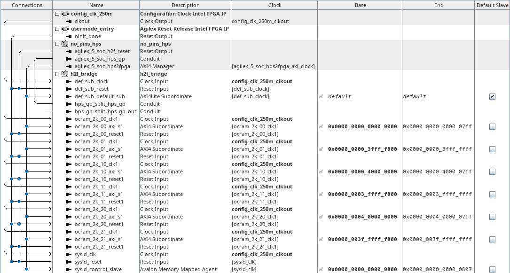
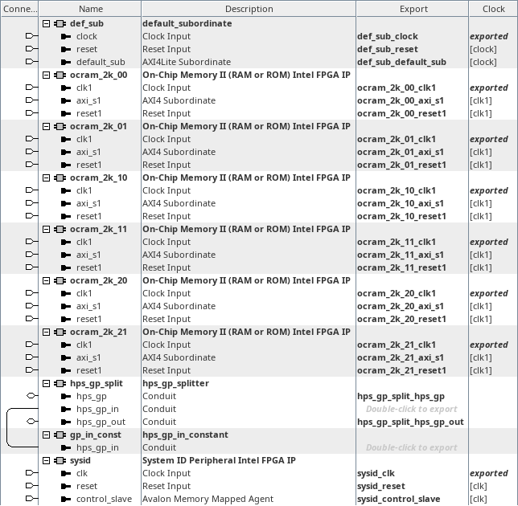

# menu-t, menu-r on hw_h2f_bridge
<!-- SPDX-FileCopyrightText: Copyright (C) 2024 Intel Corporation -->
<!-- SPDX-License-Identifier: MIT-0 -->

Return to [**Index**](01_index.md)

Hardware projects referenced from this document:
* common_pd_subsystems/hw_h2f_bridge

u-boot software applications referenced from this document:
* common_sw/u-boot_standalone_apps/h2f_bridge.c
* common_sw/u-boot_standalone_apps/h2f_bridge_def_sub.c

Linux software applications referenced from this document:
* common_sw/linux_apps/h2f_bridge.c
* common_sw/linux_apps/h2f_bridge_def_sub.c

## Overview

The menu-t and menu-r demos demonstrate the functionality of the h2f bridge. The h2f bridge is a memory mapped bridge that creates a 256GB aperture in the HPS address map to allow the processor to read/write FPGA peripheral CSRs, etc. The 256GB aperture is broken up into three smaller apertures within the HPS address map, a 1GB span, a 15GB span and a 240GB span. The data width of the h2f bridge is configurable in the Platform Designer parameters for the HPS and can be 32-bits, 64-bits or 128-bits. This example uses the 128-bit configuration.

## Hardware system

The menu-t and menu-r, h2f bridge demo, connects the h2f bridge to two 2KB FPGA OCRAM cores within each of the three sub apertures of the 256GB aperture, one mapped to the lowest 2KB span and one mapped to the highest 2KB span of each aperture. A System ID core is also connected to the h2f bridge, along with a default subordinate core. The FPGA OCRAM cores provide a trivial memory target that software can interact with. The System ID core provides a 32-bit value that we can set in Platform Designer to be a fixed constant and a timestamp value that is set with the build time of the hardware subsystem. We can use the System ID value as a signature to validate the presence of this specific design in the FPGA. The default subordinate is configured as the default slave on the h2f manager's interconnect so any undecoded transactions will be sent to the default subordinate, which will then respond with an error response over its AXI interface.

| hw_h2f_bridge top level |
| :---: |
|  |

Inside the h2f_bridge subsystem, we instantiate a component that splits the hps_gp_in and hps_gp_out interfaces from the hps_gp conduit. The hps_gp_in interface receives input from a constant component. We also see the six FPGA OCRAMs, default subordinate and System ID core that was mentioned above.

| h2f_bridge subsystem |
| :---: |
|  |


## Software demo - u-boot standalone - menu-t

### Memory validation

In the u-boot standalone application we read and write to the first word and last word of the FPGA OCRAMs in each of the three apertures with common C syntax.

```text
	/* initialize pointers to first and last word of spans */
	first_word_ptr[0] = (uint64_t *)(H2F_1G_BASE);
	last_word_ptr[0] = (uint64_t *)(H2F_1G_BASE + H2F_1G_SPAN -
							sizeof(uint64_t));
	first_word_ptr[1] = (uint64_t *)(H2F_15G_BASE);
	last_word_ptr[1] = (uint64_t *)(H2F_15G_BASE + H2F_15G_SPAN -
							sizeof(uint64_t));
	first_word_ptr[2] = (uint64_t *)(H2F_240G_BASE);
	last_word_ptr[2] = (uint64_t *)(H2F_240G_BASE + H2F_240G_SPAN -
							sizeof(uint64_t));

	/* initialize write data patterns */
	first_word_write_value[0][0] = 0x1111111111111111;
	 last_word_write_value[0][0] = 0x2222222222222222;
	first_word_write_value[1][0] = 0x3333333333333333;
	 last_word_write_value[1][0] = 0x4444444444444444;
	first_word_write_value[2][0] = 0x5555555555555555;
	 last_word_write_value[2][0] = 0x6666666666666666;

	first_word_write_value[0][1] = ~0x1111111111111111;
	 last_word_write_value[0][1] = ~0x2222222222222222;
	first_word_write_value[1][1] = ~0x3333333333333333;
	 last_word_write_value[1][1] = ~0x4444444444444444;
	first_word_write_value[2][1] = ~0x5555555555555555;
	 last_word_write_value[2][1] = ~0x6666666666666666;

	/* write values to first and last word of each span and read back */
	for(j = 0 ; j < 2 ; j++) {
		for(i = 0 ; i < 3 ; i++) {
			/* write to first word */
			*first_word_ptr[i] = first_word_write_value[i][j];

			/* write to last word */
			*last_word_ptr[i] = last_word_write_value[i][j];
		}

		for(i = 0 ; i < 3 ; i++) {
			/* read from first word */
			first_word_read_value[i][j] = *first_word_ptr[i];

			/* read from last word */
			last_word_read_value[i][j] = *last_word_ptr[i];
		}
	}
```

The output from this demo is shown below. The value of the signature read back from the hps_gp_in constant is displayed as well as the System ID values. The read back values of the low memory word and the high memory word from each aperture span are printed along with the access times for each read and write operation over two passes.

```text
H2F Demo

HPS_GP_IN signature value = 0x20463248 : H2F

SYSID_ID: 0x20463248
SYSID_TS: 0x666D39AB

     ---1GB SPAN--- :     ---PASS 1---   :     ---PASS 2---
LO WRITE ACCESS TIME:           87.500ns :           45.000ns
HI WRITE ACCESS TIME:          632.500ns :           40.000ns
 LO READ ACCESS TIME:          387.500ns :         1327.500ns
 HI READ ACCESS TIME:          315.000ns :          317.500ns
        LO READ BACK: 0x1111111111111111 : 0xEEEEEEEEEEEEEEEE
        HI READ BACK: 0x2222222222222222 : 0xDDDDDDDDDDDDDDDD

    ---15GB SPAN--- :     ---PASS 1---   :     ---PASS 2---
LO WRITE ACCESS TIME:          952.500ns :           45.000ns
HI WRITE ACCESS TIME:          915.000ns :           40.000ns
 LO READ ACCESS TIME:          300.000ns :          300.000ns
 HI READ ACCESS TIME:          320.000ns :          315.000ns
        LO READ BACK: 0x3333333333333333 : 0xCCCCCCCCCCCCCCCC
        HI READ BACK: 0x4444444444444444 : 0xBBBBBBBBBBBBBBBB

   ---240GB SPAN--- :     ---PASS 1---   :     ---PASS 2---
LO WRITE ACCESS TIME:          870.000ns :           45.000ns
HI WRITE ACCESS TIME:          950.000ns :           40.000ns
 LO READ ACCESS TIME:          302.500ns :          295.000ns
 HI READ ACCESS TIME:          317.500ns :          317.500ns
        LO READ BACK: 0x5555555555555555 : 0xAAAAAAAAAAAAAAAA
        HI READ BACK: 0x6666666666666666 : 0x9999999999999999

Press any key to exit this demo.
```

## Software demo - u-boot standalone - menu-r

### Default subordinate validation

In the u-boot standalone application we install an exception handler to capture the exception that we will generate by reading from the default subordinate through the h2f bridge. We then cause a data abort exception by reading an undecoded address through the h2f bridge which is terminated by the default subordinate.

The output from this demo is shown below. The value of the signature read back from the hps_gp_in constant is displayed as well as the System ID values. The abort handler execution is printed along with the timing of various milestones throughout the event.

```text
H2F Default Subordinate Demo

HPS_GP_IN signature value = 0x20463248 : H2F

SYSID_ID: 0x20463248
SYSID_TS: 0x666D39AB

start time: 0x00000ABA1685ABA2
abort time: 0x00000ABA1685ACEB
  end time: 0x00000ABA1685AD30

Abort handler did execute...
Default subordinate was triggered...

    time from start to abort = 822.500ns
      time from abort to end = 172.500ns
total time from start to end = 995.000ns

Press any key to exit this demo.
```

## Software demo - Linux - menu-t

### Memory validation

The Linux version of this demo is essentially the same as the u-boot standalone application except in Linux we must map a virtual address to access the physical addresses of the peripherals. We use the uio driver to facilitate that for us.

## Software demo - Linux - menu-r

### Default subordinate validation

The Linux version of this demo is essentially the same as the u-boot standalone application except in Linux we must map a virtual address to access the physical addresses of the peripherals. We use the uio driver to facilitate that for us.

We also install a SIGBUS signal handler in our user space application to recover from the data abort exception that is generated. This SIGBUS handler only appears to operate properly when the data abort is triggered from an A55 core, so we also ensure that we affine this thread to core 1 which is always an A55 core regardless of the boot core configuration of the quad core cluster.

---
Return to [**Index**](01_index.md)
