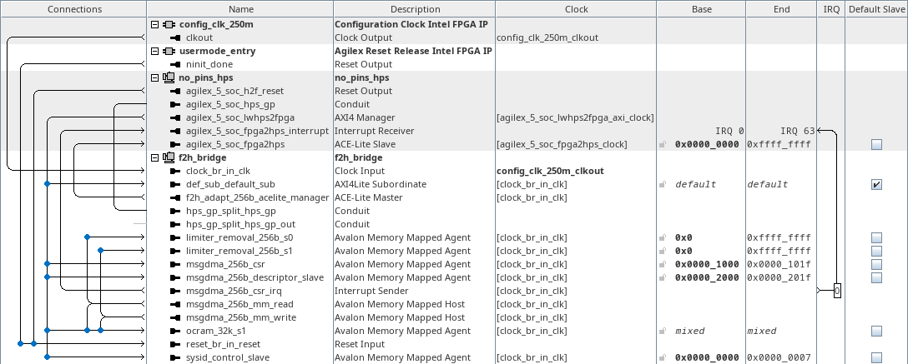
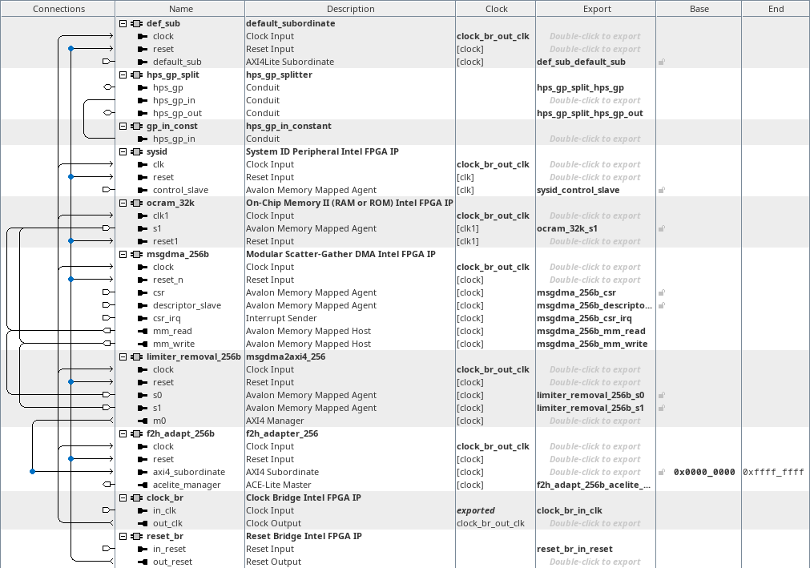

# menu-b on hw_f2h_bridge
<!-- SPDX-FileCopyrightText: Copyright (C) 2024 Intel Corporation -->
<!-- SPDX-License-Identifier: MIT-0 -->

Return to [**Index**](01_index.md)

Hardware projects referenced from this document:
* common_pd_subsystems/hw_f2h_bridge

u-boot software applications referenced from this document:
* common_sw/u-boot_standalone_apps/f2h_bridge.c

Linux software applications referenced from this document:
* common_sw/linux_apps/f2h_bridge.c

## Overview

The menu-b demo demonstrates the functionality of the f2h bridge. The f2h bridge is a memory mapped bridge that allows initiators in the FPGA fabric to read/write into the 1TB address map of the HPS. The f2h bridge provides connectivity to the 512GB span of DRAM connected through the HPS EMIF controller, as well as the other HPS peripherals implemented in the HPS core. The data width of the f2h bridge is fixed at 256-bits. This example uses the 256-bit data width configuration and a 4GB address span configuration. This allows the f2h bridge to access the lowest 2GB aperture of DRAM available thru the HPS EMIF controller beginning at 0x8000_0000 and spanning through 0xFFFF_FFFF. We do not demonstrate accessing any other peripherals within the HPS core in this demo.

**NOTE:** due to a current limitation with the ES devices, this demo must be run first after the device has been wiped, meaning a power cycle, nCONFIG assertion, etc. If this demo is run after the FPGA has previously been configured with a hardware design, then this demo will fail.

## Hardware system

The menu-b, f2h bridge demo, connects the lwh2f bridge to an msgdma core which is connected to the f2h bridge and a 32KB FPGA OCRAM. This allows software to control the msgdma core through the lwh2f bridge and command it to move data from the HPS EMIF memory to FPGA OCRAM and vice versa.

A System ID core is also connected to the lwh2f bridge, along with a default subordinate core. The System ID core provides a 32-bit value that we can set in Platform Designer to be a fixed constant and a timestamp value that is set with the build time of the hardware subsystem. We can use the System ID value as a signature to validate the presence of this specific design in the FPGA. The default subordinate is configured as the default slave on the lwh2f manager's interconnect so any undecoded transactions will be sent to the default subordinate, which will then respond with an error response over its AXI interface.

| hw_f2h_bridge top level |
| :---: |
|  |

Inside the f2h_bridge subsystem, we instantiate a component that splits the hps_gp_in and hps_gp_out interfaces from the hps_gp conduit. The hps_gp_in interface receives input from a constant component. We also see the msgdma, FPGA OCRAM, default subordinate and System ID core that was mentioned above.

Two additional components are visible in the f2h_bridge subsystem, a limiter_removal core and an f2h_adapter core. The limiter_removal core translates the Avalon MM interfaces from the msgdma core into AXI4 so that the Platform Designer interconnect generator does not see a need to insert limiter cores within the interconnect that it generates along that data path. The f2h_adapter core is used to decorate the AXI4 transactions passed into the f2h bridge properly, so they are routed and managed properly within the HPS subsystem.

| f2h_bridge subsystem |
| :---: |
|  |


## Software demo - u-boot standalone - menu-b

In the u-boot standalone application we configure the msgdma core to move a 32KB randomized data pattern from an initial buffer allocated in HPS EMIF memory to the FPGA OCRAM memory. Then we configure the msgdma core to move the 32KB data from the FPGA OCRAM memory to a secondary buffer in HPS EMIF memory. The initial buffer contents are then checked against the secondary buffer contents to ensure the data movement occurred as expected.

Since the f2h bridge can pass cache coherent transactions, this demo is executed two different ways, first with the data cache flushed prior to the msgdma transfer and then with the data cache left charged with data prior to the msgdma transfer. This illustrates the different behavior that is experienced when the msgdma interacts with cached and non-cached buffers.

This code example demonstrates the cache flushed scenario:
```text
	/*
	 * we will now DMA data from dma_buffer_0 to the FPGA OCRAM buffer
	 * and then DMA from the FPGA OCRAM buffer to dma_buffer_1
	 *
	 * the data cache WILL be flushed prior to triggering the dma so the
	 * coherent transactions WILL NOT hit the cache
	 */

	/* clear the three buffers that we'll use for DMA transfers */
	/* this isn't necessary but for demonstration purposes we'll do it */
	memset(dma_buffer_0, 0, F2H_OCRAM_32K_SPAN);
	memset(dma_buffer_1, 0, F2H_OCRAM_32K_SPAN);
	memset((void*)(F2H_OCRAM_32K_BASE), 0, F2H_OCRAM_32K_SPAN);

	/* fill the initial buffer with a randomized data pattern */
	asm volatile (
		"dsb sy\n"
		"mrs %[temp], cntpct_el0\n"
		: [temp] "=r" (temp)
	);
	temp ^= 0xFbFdF1F3F5F7FbFd;
	temp += 0x0b0d010305070b0d;
	for(i = 0 ; i < (F2H_OCRAM_32K_SPAN / sizeof(uint64_t)) ; i++) {
		temp += 0x0b0d010305070b0d;
		dma_buffer_0_word_ptr[i] = temp++;
	}

	/* flush the data cache */
	flush_dcache_range((uint64_t)dma_buffer_0,
		(uint64_t)((void*)(dma_buffer_0) + F2H_OCRAM_32K_SPAN));
	flush_dcache_range((uint64_t)dma_buffer_1,
		(uint64_t)((void*)(dma_buffer_1) + F2H_OCRAM_32K_SPAN));

	/* make sure the MSGDMA is not currently busy */
	temp_32 = ((volatile uint32_t *)(F2H_MSGDMA_CSR_BASE))[0];
	if(temp_32 != 0x00000002) {
		f2h_bridge->error = 2;
		return;
	}

	/* build our descriptor for dma_buffer_0 to FPGA OCRAM */
	descriptor[0] = (uint64_t)(dma_buffer_0) & 0xFFFFFFFF;
	descriptor[1] = MSGDMA_OCRAM_32K_BASE & 0xFFFFFFFF;
	descriptor[2] = F2H_OCRAM_32K_SPAN;
	descriptor[3] = 0x00000000;
	descriptor[4] = 0x00000000;
	descriptor[5] = (uint64_t)(dma_buffer_0) >> 32;
	descriptor[6] = MSGDMA_OCRAM_32K_BASE >> 32;
	descriptor[7] = 0x80000000;

	/* push the descriptor into the MSGDMA */
	for(i = 0 ; i < 8 ; i++) {
		((volatile uint32_t *)(F2H_MSGDMA_DES_BASE))[i] =
								descriptor[i];
	}

	/* wait for the DMA to idle, timeout after 1ms */
	asm volatile (
		"dsb sy\n"
		"mrs %[temp], cntpct_el0\n"
		: [temp] "=r" (temp)
	);
	timeout = temp + (cntfrq_el0 / 1000);

	temp_32 = ((volatile uint32_t *)(F2H_MSGDMA_CSR_BASE))[0];
	while((temp_32 & 0x00000001) == 0x00000001) {
		asm volatile (
			"dsb sy\n"
			"mrs %[temp], cntpct_el0\n"
			: [temp] "=r" (temp)
		);
		if(temp >= timeout) {
			f2h_bridge->error = 3;
			return;
		}
		temp_32 = ((volatile uint32_t *)(F2H_MSGDMA_CSR_BASE))[0];
	}

	/* initialize intermediate DMA pointers for F2H transfer */
	dma_rd_ptr = MSGDMA_OCRAM_32K_BASE;
	dma_wr_ptr = (uint64_t)(dma_buffer_1);

	/* make sure the MSGDMA is not currently busy */
	temp_32 = ((volatile uint32_t *)(F2H_MSGDMA_CSR_BASE))[0];
	if(temp_32 != 0x00000002) {
		f2h_bridge->error = 4;
		return;
	}

	/* build our descriptor for FPGA OCRAM to dma_buffer_0 */
	descriptor[0] = dma_rd_ptr & 0xFFFFFFFF;
	descriptor[1] = dma_wr_ptr & 0xFFFFFFFF;
	descriptor[2] = F2H_OCRAM_32K_SPAN;
	descriptor[3] = 0x00000000;
	descriptor[4] = 0x00000000;
	descriptor[5] = dma_rd_ptr >> 32;
	descriptor[6] = dma_wr_ptr >> 32;
	descriptor[7] = 0x80000000;

	/* push the descriptor into the MSGDMA */
	for(i = 0 ; i < 4 ; i++) {
		((volatile uint64_t *)(F2H_MSGDMA_DES_BASE))[i] =
			((uint64_t)(descriptor[(i * 2) + 1]) << 32) |
			descriptor[i * 2];
	}

	/* wait for the DMA to idle, timeout after 1ms */
	asm volatile (
		"dsb sy\n"
		"mrs %[temp], cntpct_el0\n"
		: [temp] "=r" (temp)
	);
	timeout = temp + (cntfrq_el0 / 1000);

	temp_32 = ((volatile uint32_t *)(F2H_MSGDMA_CSR_BASE))[0];
	while((temp_32 & 0x00000001) == 0x00000001) {
		asm volatile (
			"dsb sy\n"
			"mrs %[temp], cntpct_el0\n"
			: [temp] "=r" (temp)
		);
		if(temp >= timeout) {
			f2h_bridge->error = 5;
			return;
		}
		temp_32 =
		((volatile uint32_t *)(F2H_MSGDMA_CSR_BASE))[0];
	}

	/* dsb so that a76 waits for outstanding io before comparing buffers */
	asm volatile (
		"dsb sy\n"
	);

	/* verify the initial buffer matches the final buffer */
	if(memcmp(dma_buffer_0, dma_buffer_1, F2H_OCRAM_32K_SPAN) == 0) {
		f2h_bridge->error = 0;
	} else {
		f2h_bridge->error = 6;
	}
```

The output from this demo is shown below. The value of the signature read back from the hps_gp_in constant is displayed as well as the System ID values. The status of the initial and secondary buffer comparison is also displayed. The time required to execute each stage of the process is also printed in the output. The same buffer comparison and timing information is displayed for the data cache flush pass and the non-flush pass.

```text
F2H Demo

HPS_GP_IN signature value = 0x20483246 : F2H

SYSID_ID: 0x20483246
SYSID_TS: 0x668DD81F

---------- data cache flushed ----------

No errors detected...

   DCACHE FLUSH TIME:     19540.000ns
 BUFFER COMPARE TIME:    234412.500ns
HPS to FPGA DMA TIME:     92417.500ns :   0.330GB/s
FPGA to HPS DMA TIME:      6055.000ns :   5.040GB/s

---------- data cache NOT flushed ----------

No errors detected...

 BUFFER COMPARE TIME:    209130.000ns
HPS to FPGA DMA TIME:     11760.000ns :   2.595GB/s
FPGA to HPS DMA TIME:     13830.000ns :   2.206GB/s

Press any key to exit this demo.
```

## Software demo - Linux - menu-b

The Linux version of this demo is essentially the same as the u-boot standalone application except in Linux we must map a virtual address to access the physical addresses of the peripherals. We use the uio driver to facilitate that for us.

The HPS EMIF memory buffer that we use is allocated from a reserved memory buffer that we define in the Linux devicetree so we completely control the allocation of that reserved memory for our own needs. We only demonstrate the non-cacheable flow in Linux because there is no convenient way to map our virtual buffers to be cacheable without a custom kernel module, which we have not created at this time.

In Linux, we also demonstrate two methods of determining when the msgdma core has completed the transfers. First, we demonstrate a polling method like we used in the u-boot application, and then we demonstrate an interrupt method which we also facilitate through a uio driver.

---
Return to [**Index**](01_index.md)
