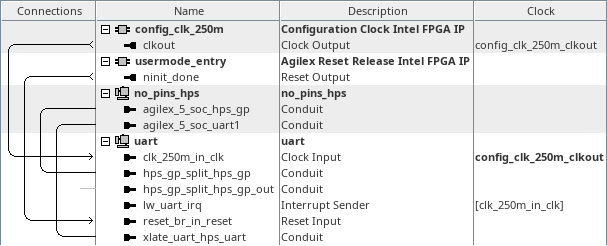
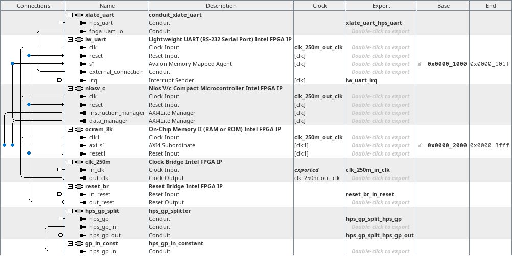

# menu-k on hw_uart
<!-- SPDX-FileCopyrightText: Copyright (C) 2024 Intel Corporation -->
<!-- SPDX-License-Identifier: MIT-0 -->

Return to [**Index**](01_index.md)

Hardware projects referenced from this document:
* common_pd_subsystems/hw_uart

u-boot software applications referenced from this document:
* common_sw/u-boot_standalone_apps/uart.c

Linux software applications referenced from this document:
* common_sw/linux_apps/uart.c
* common_sw/linux_apps/uart_drvr.c

## Overview

The menu-k demo demonstrates the functionality of the HPS UART peripheral. It does this by connecting the HPS UART peripheral to an FPGA based design that contains a Lightweight UART core that is controlled by a Nios V/c subsystem. When the Nios V/c subsystem receives a character over the LWUART core from the HPS UART core, it inverts the data and sends it back out the LWUART core to be received by the HPS UART core.

**NOTE:** the configuration clock frequency for the 4S and 5S speed grade devices is expected to be 250MHz when an SDM OSC_CLK frequency is specified. The configuration clock frequency for the 6S speed grade device is expected to be 200MHz when an SDM OSC_CLK frequency is specified. This demo currently assumes the FPGA configuration clock frequency is 250MHz and therefore configures the baud rate of the FPGA based UART based on that assumption. If your board implements a 200MHz configuration clock frequency, then the baud rate will be incorrect, and you will witness data corruption communicating with the FPGA based UART.

## Hardware system

The menu-k, uart demo, connects the HPS UART to an LWUART core which is controlled by a Nios V/c subsystem.

| hw_uart top level |
| :---: |
|  |

Inside the uart subsystem, we instantiate a component that splits the hps_gp_in and hps_gp_out interfaces from the hps_gp conduit. The hps_gp_in interface receives input from a constant component. We also see the Nios V/c processor, its program/data memory and the LWUART core that it controls.

| uart subsystem |
| :---: |
|  |


## Software demo - u-boot standalone - menu-k

In the u-boot standalone application we bit bang the HPS UART registers to send characters through the HPS UART peripheral.

An 8-byte randomized value is created and transmitted out the HPS UART and 8-bytes are received at the same time. This operation is first performed through the internal HPS UART loop back, and then it is performed through the LWUART in the FPGA design.

```text
	/* release uart1 from reset */
	per1modrst = *((volatile uint32_t *)(PER1MODRST_BASE));
	*((volatile uint32_t *)(PER1MODRST_BASE)) =
					per1modrst & (~PER1MODRST_THE_UART);

	asm volatile (
		"dsb sy\n"
	);

	/* set srr */
	*((volatile uint32_t *)(THE_UART_BASE + HPS_UART_SRR_OFST)) = 0x01;

	/* create a timeout after 1ms */
	asm volatile (
		"mrs %[temp], cntpct_el0\n"
		: [temp] "=r" (temp)
	);
	timeout = temp + (cntfrq_el0 / 1000);

	do {
		asm volatile (
			"mrs %[temp], cntpct_el0\n"
			: [temp] "=r" (temp)
		);
	} while(temp < timeout);

	/* set dlab in lcr */
	*((volatile uint32_t *)(THE_UART_BASE + HPS_UART_LCR_OFST)) = 0x83;
	/* set dll - 115200 baud */
	*((volatile uint32_t *)(THE_UART_BASE + HPS_UART_RBR_OFST)) = 0x36;
	/* set dlh - 115200 baud */
	*((volatile uint32_t *)(THE_UART_BASE + HPS_UART_IER_OFST)) = 0x00;
	/* set lcr */
	*((volatile uint32_t *)(THE_UART_BASE + HPS_UART_LCR_OFST)) = 0x03;
	/* set mcr */
	*((volatile uint32_t *)(THE_UART_BASE + HPS_UART_MCR_OFST)) = 0x13;

	/* create a timeout after 1ms */
	asm volatile (
		"mrs %[temp], cntpct_el0\n"
		: [temp] "=r" (temp)
	);
	timeout = temp + (cntfrq_el0 / 1000);

	/* transmit and receive 8 characters */
	while((tx_value_index < 8) || (rx_value_index < 8)) {

		asm volatile (
			"dsb sy\n"
		);

		lsr = *((volatile uint32_t *)(THE_UART_BASE +
							HPS_UART_LSR_OFST));

		if(((lsr & HPS_UART_LSR_THRE) == HPS_UART_LSR_THRE) &&
							(tx_value_index < 8))
			*((volatile uint32_t *)(THE_UART_BASE +
			HPS_UART_RBR_OFST)) = tx_value_ptr[tx_value_index++];

		if(((lsr & HPS_UART_LSR_DR) == HPS_UART_LSR_DR) &&
							(rx_value_index < 8))
			rx_value_ptr[rx_value_index++] =
				(*((volatile uint32_t *)(THE_UART_BASE +
							HPS_UART_RBR_OFST)));

		asm volatile (
			"mrs %[temp], cntpct_el0\n"
			: [temp] "=r" (temp)
		);
		if(temp >= timeout)
			break;
	}

	asm volatile (
		"dsb sy\n"
	);
```

The output from this demo is shown below. The value of the signature read back from the hps_gp_in constant is displayed. The time to transmit and receive the 8-byte pattern is displayed along with the transmit pattern and receive pattern and the xor of the two values. The loop back pass is displayed first and the LWUART pass is displayed second.

```text
HPS UART Demo

HPS_GP_IN signature value = 0x54524155 : UART

uart_time_loop =    697432.500ns
 tx_value_loop = 0xBFB68534FBF2CB43
 rx_value_loop = 0xBFB68534FBF2CB43
xor_value_loop = 0x0000000000000000

uart_time_fpga =    778865.000ns
 tx_value_fpga = 0xBFBD201DFBF96E6A
 rx_value_fpga = 0x4042DFE204069195
xor_value_fpga = 0xFFFFFFFFFFFFFFFF

Press any key to exit this demo.
```

## Software demo - Linux - menu-k

The Linux version of this demo is essentially the same as the u-boot standalone application except in Linux we must map a virtual address to access the physical addresses of the peripherals. We use the uio driver to facilitate that for us.

## Software demo - Linux - menu-K

In the menu-K version of this demo, we use the actual UART driver in the Linux kernel to control the HPS UART peripheral.

---
Return to [**Index**](01_index.md)
