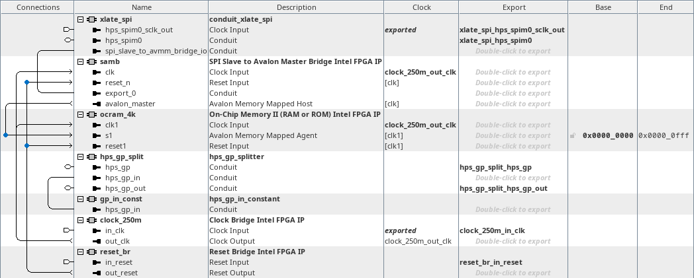

# menu-f on hw_spi_bridge
<!-- SPDX-FileCopyrightText: Copyright (C) 2024 Intel Corporation -->
<!-- SPDX-License-Identifier: MIT-0 -->

Return to [**Index**](01_index.md)

Hardware projects referenced from this document:
* common_pd_subsystems/hw_spi_bridge

u-boot software applications referenced from this document:
* common_sw/u-boot_standalone_apps/spi_bridge.c

Linux software applications referenced from this document:
* common_sw/linux_apps/spi_bridge.c
* common_sw/linux_apps/spi_bridge_drvr.c

## Overview

The menu-f demo demonstrates the functionality of the HPS SPI peripheral. It does this by connecting the HPS SPI peripheral to an FPGA based design that contains an SPI-to-Avalon-Master-Bridge (SAMB) core connected to an FPGA OCRAM. This allows the HPS core to read and write the FPGA OCRAM memory through the SPI interface.

## Hardware system

The menu-f, spi bridge demo, connects the HPS SPI to an SAMB core.

| hw_spi_bridge top level |
| :---: |
|  |

Inside the spi_bridge subsystem, we instantiate a component that splits the hps_gp_in and hps_gp_out interfaces from the hps_gp conduit. The hps_gp_in interface receives input from a constant component. We also see the SAMB core and the FPGA OCRAM that it connects to.

| spi_bridge subsystem |
| :---: |
|  |


## Software demo - u-boot standalone - menu-f

In the u-boot standalone application we bit bang the HPS SPI registers to send SAMB messages through the HPS SPI peripheral.

A 32-bit randomized value is created and written through the SAMB core into the FPGA OCRAM and then read back. Then a 4KB buffer of randomized data is created and written through the SAMB core into the FPGA OCRAM and then read back. The 4KB transmit buffer is then compared with the 4KB receive buffer to validate the operation completed successfully.

Please see the actual source files for this demo for details about how this SAMB communication API is implemented over the SPI peripheral.

The output from this demo is shown below. The value of the signature read back from the hps_gp_in constant is displayed. The time to transmit and receive the 32-bit pattern is displayed along with the transmit pattern and receive pattern. Then the time to transmit and receive the 4KB pattern is displayed along with the result of the data comparison.

```text
HPS SPIM bridge Demo

HPS_GP_IN signature value = 0x424D4153 : SAMB

No Transaction Operation
         Operation:    SUCCESSFUL
              Time:      8967.500ns

SPI Write reg32 Operation
         Operation:    SUCCESSFUL
              Time:      9920.000ns
             Value:    0x02102326

SPI Read reg32 Operation
         Operation:    SUCCESSFUL
              Time:     10005.000ns
             Value:    0x02102326

SPI 4KB Write Read Operation
   Write Operation:    SUCCESSFUL
        Write Time:   1025642.500ns
    Read Operation:    SUCCESSFUL
         Read Time:   6031495.000ns
   Data Comparison:    SUCCESSFUL

Press any key to exit this demo.
```

## Software demo - Linux - menu-f

The Linux version of this demo is essentially the same as the u-boot standalone application except in Linux we must map a virtual address to access the physical addresses of the peripherals. We use the uio driver to facilitate that for us.

## Software demo - Linux - menu-F

In the menu-F version of this demo, we use the actual SPI driver in the Linux kernel to control the HPS SPI peripheral.

---
Return to [**Index**](01_index.md)
