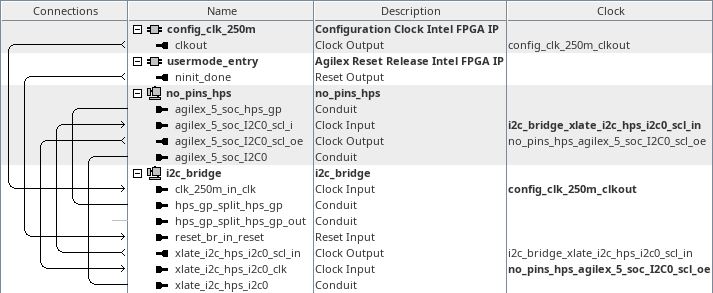
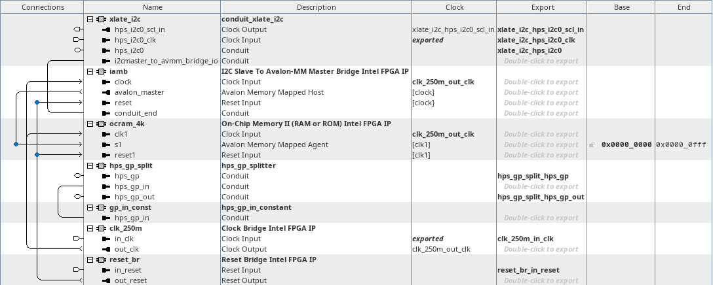

# menu-e on hw_i2c_bridge
<!-- SPDX-FileCopyrightText: Copyright (C) 2024 Intel Corporation -->
<!-- SPDX-License-Identifier: MIT-0 -->

Return to [**Index**](01_index.md)

Hardware projects referenced from this document:
* common_pd_subsystems/hw_i2c_bridge

u-boot software applications referenced from this document:
* common_sw/u-boot_standalone_apps/i2c_bridge.c

Linux software applications referenced from this document:
* common_sw/linux_apps/i2c_bridge.c
* common_sw/linux_apps/i2c_bridge_drvr.c

## Overview

The menu-e demo demonstrates the functionality of the HPS I2C peripheral. It does this by connecting the HPS I2C peripheral to an FPGA based design that contains an I2C-to-Avalon-Master-Bridge (IAMB) core connected to an FPGA OCRAM. This allows the HPS core to read and write the FPGA OCRAM memory through the I2C interface.

## Hardware system

The menu-e, i2c bridge demo, connects the HPS I2C to an IAMB core.

| hw_i2c_bridge top level |
| :---: |
|  |

Inside the i2c_bridge subsystem, we instantiate a component that splits the hps_gp_in and hps_gp_out interfaces from the hps_gp conduit. The hps_gp_in interface receives input from a constant component. We also see the IAMB core and the FPGA OCRAM that it connects to.

| i2c_bridge subsystem |
| :---: |
|  |


## Software demo - u-boot standalone - menu-e

In the u-boot standalone application we bit bang the HPS I2C registers to send IAMB messages through the HPS I2C peripheral.

A 32-bit randomized value is created and written through the IAMB core into the FPGA OCRAM and then read back. Then a 4KB buffer of randomized data is created and written through the IAMB core into the FPGA OCRAM and then read back. The 4KB transmit buffer is then compared with the 4KB receive buffer to validate the operation completed successfully.

Please see the actual source files for this demo for details about how this IAMB communication API is implemented over the I2C peripheral.

The output from this demo is shown below. The value of the signature read back from the hps_gp_in constant is displayed. The time to transmit and receive the 32-bit pattern is displayed along with the transmit pattern and receive pattern. Then the time to transmit and receive the 4KB pattern is displayed along with the result of the data comparison.

```text
HPS I2C Bridge Demo

HPS_GP_IN signature value = 0x424D4149 : IAMB

I2C Write reg32 Operation
         Operation:    SUCCESSFUL
              Time:    206367.500ns
             Value:    0x835D509E

I2C Read reg32 Operation
         Operation:    SUCCESSFUL
              Time:    232392.500ns
             Value:    0x835D509E

I2C 4KB Write Read Operation
   Write Operation:    SUCCESSFUL
        Write Time:  91706112.500ns
    Read Operation:    SUCCESSFUL
         Read Time: 237108105.000ns
   Data Comparison:    SUCCESSFUL

Press any key to exit this demo.
```

## Software demo - Linux - menu-e

The Linux version of this demo is essentially the same as the u-boot standalone application except in Linux we must map a virtual address to access the physical addresses of the peripherals. We use the uio driver to facilitate that for us.

## Software demo - Linux - menu-E

In the menu-E version of this demo, we use the actual I2C driver in the Linux kernel to control the HPS I2C peripheral.

---
Return to [**Index**](01_index.md)
