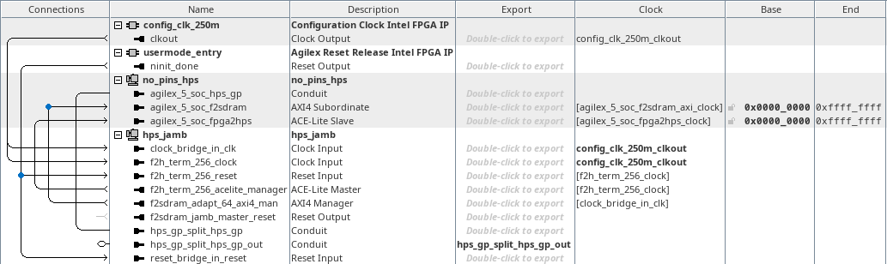
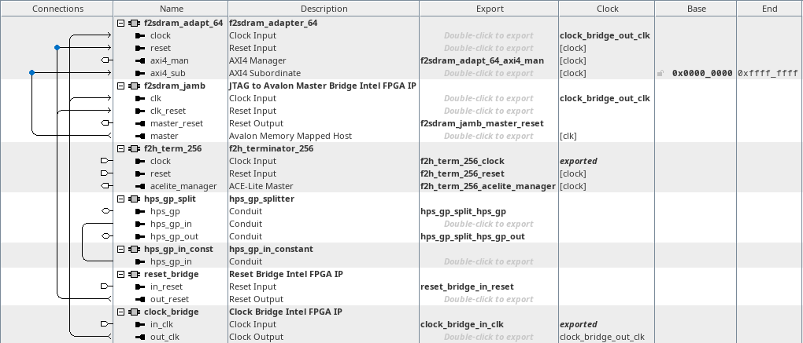

# menu-j on hw_hps_jamb
<!-- SPDX-FileCopyrightText: Copyright (C) 2024 Intel Corporation -->
<!-- SPDX-License-Identifier: MIT-0 -->

Return to [**Index**](01_index.md)

Hardware projects referenced from this document:
* common_pd_subsystems/hw_hps_jamb

u-boot software applications referenced from this document:
* none

Linux software applications referenced from this document:
* none

## Overview

The menu-j option loads a maintenance image that can be used for development purposes or other experiments that are not built into the default demos. The FPGA image contains a JTAG-to-Avalon-Master-Bridge (JAMB) core connected to the f2sdram bridge of the HPS to facilitate copying binary data images directly into the HPS EMIF memory. This allows FPGA core.rbf images, flash update images, or software applications to be loaded into the HPS EMIF memory so it can be used in either the u-boot or Linux environment.

## Hardware system

The menu-j design connects the f2sdram bridge to a JAMB core.

| hw_hps_jamb top level |
| :---: |
|  |

Inside the hps_jamb subsystem, we instantiate a component that splits the hps_gp_in and hps_gp_out interfaces from the hps_gp conduit. The hps_gp_in interface receives input from a constant component. We also see the JAMB core and the adapters that connect it into the f2sdram bridge of the HPS.

| hps_jamb subsystem |
| :---: |
|  |

## Use cases for the JAMB design in u-boot - menu-j

The u-boot environment provides an x-modem download option to load binary data images into memory over the console UART. This communication path is convenient and very functional, but also very slow. When you need to copy larger data images into the system, or out of the system, the JAMB maintenance image can facilitate communication over the JTAG interface which can support data transfer rates of ~1MB/s.

Once the JAMB image is loaded into the FPGA using menu-j, we can use system-console to open a master service path and then copy binary images into the HPS EMIF memory like this:
```text
% set jamb [ lindex [ get_service_paths master ] 0 ]
% open_service master $jamb

% master_write_from_file $jamb <path-to>/u-boot.itb.bin 0x86000000
% master_write_from_file $jamb <path-to>/lzma-no-pins-demos.itb.bin 0x86000000
```

### Updating demo flash images

In the case of the u-boot.itb image or the demos.itb image, once either of these are loaded into HPS EMIF memory, we can run the corresponding menu-u or menu-d commands to validate and program each image into the SDM QSPI flash device.

### Loading a core.rbf image

In the case of an FPGA core.rbf configuration image, you can start by flushing the data cache from the u-boot console:
```text
SOCFPGA_AGILEX5 # dcache flush
```

Load your core.rbf image into HPS EMIF memory using system-console.

Then program the core.rbf into the FPGA logic like this:
```text
SOCFPGA_AGILEX5 # bridge disable
SOCFPGA_AGILEX5 # fpga load 0 <core.rbf-addr> <core.rbf-size>
SOCFPGA_AGILEX5 # bridge enable
```

**NOTE:** the address 0x9000_0000 or 0xA000_0000 is a convenient address to load a core.rbf into HPS EMIF memory.

### Loading a software application image

In the case of a software application image, you can start by flushing the data cache from the u-boot console:
```text
SOCFPGA_AGILEX5 # dcache flush
```

Load your software application image into HPS EMIF memory using system-console.

Then run the software application like this:
```text
SOCFPGA_AGILEX5 # icache flush
SOCFPGA_AGILEX5 # go <application-addr>
```

**NOTE:** the address 0x9000_0000 or 0xA000_0000 is a convenient address to load a software application into HPS EMIF memory.

## Use cases for the JAMB design in Linux - menu-j

The Linux environment that we load contains no useful communication path for downloading binary data into the target. When you need to copy data images into the system, or out of the system, the JAMB maintenance image can facilitate communication over the JTAG interface which can support data transfer rates of ~1MB/s.

Once the JAMB image is loaded into the FPGA using menu-j, we can use system-console to open a master service path and then copy binary images into the HPS EMIF memory like this:
```text
% set jamb [ lindex [ get_service_paths master ] 0 ]
% open_service master $jamb

% master_write_from_file $jamb <path-to>/my_app 0x82000000
```

**NOTE:** the bootloader reserves a 64MB region of memory at 0x8200_0000 in the Linux devicetree so that region can be used to pass data into or out of the system using the JAMB FPGA image.

## Loading a software application image

In the case of a software application image, you can start by flushing the data cache from the Linux console. Since we do not have a good way of doing this from user space, we can force the cache system to clean itself by reading a block of data larger than the largest cache memory in the system. The L3 cache is 2MB in size, so if we read a 4MB block of data from memory we can force the cache to purge naturally. In this example we use the 'dd' command to copy a 4MB block of data from 0x8240_0000 into the file called 'trash'. Note that the reading of the location 0x8240_0000 using '/dev/mem' will not be cacheable but the writing of the 'trash' file in 'tmpfs' should be, so the purge we desire should occur.
```text
# dd if=/dev/mem of=trash bs=1M count=4 skip=0x824
```

Once we flush the data cache, we can use system console to copy the application image into HPS EMIF memory.

Then we can copy the application image out of memory into a file that we can then execute. In this example we just copy a 1MB block of data that we assume contains the entire software image. We assume that the software application is loaded into memory at 0x8200_0000:
```text
# dd if=/dev/mem of=./test bs=1M count=0x1 skip=0x820
# chmod +x ./test
# ./test
```

### Loading a core.rbf image

The same techniques that were described for the software image loading above can be used to load a new core.rbf image to reconfigure the FPGA logic with, however, in the Linux environment you would need to provide the core.rbf file, and the devicetree overlay file that describes the FPGA reconfiguration requirements. You would also need to ensure that the precise size of the core.rbf file is preserved unlike the gross over reading that we demonstrated with the software image above. The precise size of the devicetree overlay file should not be important.

---
Return to [**Index**](01_index.md)
