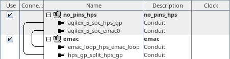
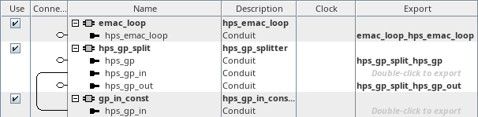

# menu-T on hw_emac
<!-- SPDX-FileCopyrightText: Copyright (C) 2024 Intel Corporation -->
<!-- SPDX-License-Identifier: MIT-0 -->

Return to [**Index**](01_index.md)

Hardware projects referenced from this document:
* common_pd_subsystems/hw_emac

u-boot software applications referenced from this document:
* common_sw/u-boot_standalone_apps/emac.c

Linux software applications referenced from this document:
* common_sw/linux_apps/emac.c

## Overview

The menu-T demo demonstrates the functionality of the HPS EMAC peripheral. It does this by connecting the HPS EMAC peripheral to an FPGA based design that contains a GMII loopback peripheral. This allows the HPS EMAC core to transmit packets to itself through the FPGA core logic design.

## Hardware system

The menu-T, emac demo, connects the HPS EMAC to a custom Platform Designer peripheral that provides a loopback for the GMII interface exposed into the FPGA logic.

| hw_emac top level |
| :---: |
|  |

Inside the emac subsystem, we instantiate a component that splits the hps_gp_in and hps_gp_out interfaces from the hps_gp conduit. The hps_gp_in interface receives input from a constant component. We also see the hps_emac_loop core that provides the GMII loopback functionality.

| emac subsystem |
| :---: |
|  |


## Software demo - u-boot standalone - menu-T

In the u-boot standalone application we bit bang the HPS EMAC registers to send packets through the HPS EMAC peripheral.

A 32KB buffer in HPS EMIF memory is filled with randomized data and each 1KB block is edited to create a viable Ethernet frame header with destination and source MAC addresses and a valid length field. Then a transmit descriptor ring is created in the HPS EMIF memory to point to the 32 transmit packets and a receive descriptor ring is created in the HPS EMIF memory to point to a 32KB buffer that can receive the 32 1KB packets that are transmitted.  The HPS EMAC is then configured to enable its DMA and packet transmission and reception.  Once the transmit and receive descriptor rings are completed, the 32KB receive buffer is compare against the 32KB transmit buffer to validate the proper transmission and reception of the test data.

The packet construction, transmission and reception described above is transmitted through the HPS EMAC using two different PHY interface configurations in the system manager. The first configuration sets the PHY interface in the RESET state which requires us to configure the HPS EMAC to use its internal loopback to loop the transmitted packets back into itself. The second configuration sets the PHY interface to the GMII state which connects the HPS EMAC to the FPGA logic design and the FPGA logic performs the loopback into the HPS EMAC for us.

The output from this demo is shown below. The value of the signature read back from the hps_gp_in constant is displayed. The time to transmit and receive the 32KB buffer through the internal HPS EMAC loopback and the FPGA based GMII loopback is displayed. And the time to flush the data cache and perform the buffer comparison is also displayed.

```text
HPS EMAC Demo

HPS_GP_IN signature value = 0x43414D45 : EMAC

No errors detected...

          DCACHE FLUSH TIME:     20320.000ns
        BUFFER COMPARE TIME:    215917.500ns
HPS EMAC INTERNAL LOOP TIME:    251872.500ns :   0.121GB/s
          DCACHE FLUSH TIME:     20325.000ns
        BUFFER COMPARE TIME:    217412.500ns
             GMII LOOP TIME:    251082.500ns :   0.121GB/s

Press any key to exit this demo.
```

## Software demo - Linux - menu-T

The Linux version of this demo is essentially the same as the u-boot standalone application except in Linux we must map a virtual address to access the physical addresses of the peripherals. We use the uio driver to facilitate that for us.

We also cannot control the phy_intf_sel register in the system manager from user space, so the Linux version determines what state the PHY interface is configured for and runs the demo based on that configuration.

The output from this demo is shown below. The value of the signature read back from the hps_gp_in constant is displayed. The time to transmit and receive the 32KB buffer through the internal HPS EMAC loopback or the FPGA based GMII loopback is displayed based on the phy_intf_sel configuration. And the time to perform the buffer comparison is also displayed.

This is the result from running through the internal HPS EMAC loopback:
```text
HPS EMAC Demo

HPS_GP_IN signature value = 0x43414D45 : EMAC

No errors detected...

        BUFFER COMPARE TIME:  14805695.000ns
HPS EMAC INTERNAL LOOP TIME:    253562.500ns :   0.120GB/s

    This demo used the HPS EMAC internal loopback because the
    phy_intf_sel field of the tsn0 register in the system manager was
    NOT configured for GMII mode. The tsn0 register at 0x10D12044 can be
    read from user mode but it requires secure/privileged state to write
    that register.

    To run this demo with the GMII loopback provided in the FPGA logic
    design, reboot the board and run the hps emac demo in the u-boot
    environment first and then boot into Linux and run this demo again.
    When the u-boot version of this demo runs, it runs using the
    internal HPS EMAC loopback first and then uses the GMII loopback and
    leaves the phy_intf_sel configuration set to GMII.

Press any key to exit this demo.
```

This is the result from running through the GMII loopback in the FPGA logic:
```text
HPS EMAC Demo

HPS_GP_IN signature value = 0x43414D45 : EMAC

No errors detected...

        BUFFER COMPARE TIME:  23352462.500ns
             GMII LOOP TIME:    249302.500ns :   0.122GB/s

    This demo used the GMII loopback provided in the FPGA logic because
    the phy_intf_sel field of the tsn0 register in the system manager
    was configured for GMII mode. The tsn0 register at 0x10D12044 can be
    read from user mode but it requires secure/privileged state to write
    that register.

    To run this demo with the HPS EMAC internal loopback, reboot the
    board and DO NOT run the hps emac demo in the u-boot environment
    before booting into Linux and run this demo again. When the u-boot
    version of this demo runs, it runs using the internal HPS EMAC
    loopback first and then uses the GMII loopback and leaves the
    phy_intf_sel configuration set to GMII.

Press any key to exit this demo.
```

---
Return to [**Index**](01_index.md)
